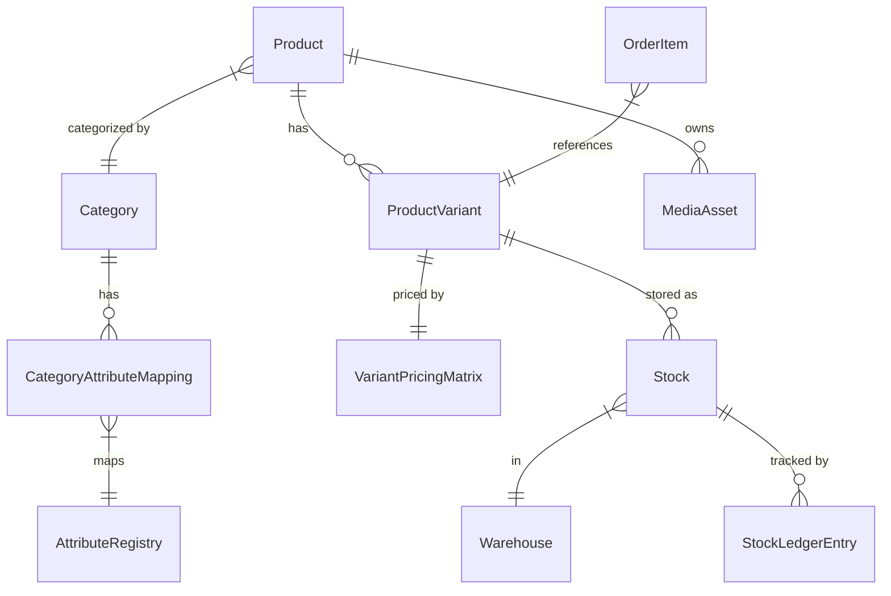

# PIM & Enterprise Inventory Architecture Documentation
This document outlines the detailed Product Information Management (PIM) and multi-warehouse Enterprise Inventory architecture implemented in the `development` branch of the Mystic Fashion platform. Use this guide to replicate the changes on the `main` branch.

---

## 1. Architectural Blueprint
The PIM upgrade redesigns how products, attributes, prices, and stock levels are modeled. In the legacy architecture, pricing and images were modeled at the product level, and stock was a simple column on variants. 

The new architecture modularizes these properties, enabling category-specific attributes, variant-specific pricing matrices, multi-warehouse stock allocations, and audit ledger tracking.

### High-Level ER Diagram


---

## 2. Database Schema Modifications (`prisma/schema.prisma`)

### A. New Models
#### `Warehouse`
Represents physical storage locations for fulfilling orders.
```prisma
model Warehouse {
  id        String   @id @default(uuid())
  code      String   @unique // e.g. "WH-MAIN"
  name      String
  address   String
  isActive  Boolean  @default(true)
  createdAt DateTime @default(now())
  updatedAt DateTime @updatedAt
  stocks    Stock[]
}
```

#### `Stock`
Maintains variant stock balances inside specific warehouses. It uses an integer `version` field for **Optimistic Concurrency Control (OCC)** to prevent race conditions during concurrent checkouts.
```prisma
model Stock {
  id                String             @id @default(uuid())
  variantId         String
  warehouseId       String
  physicalQuantity  Int                @default(0) // Quantity physically in warehouse
  reservedQuantity  Int                @default(0) // Allocated to orders (not yet shipped)
  availableQuantity Int                @default(0) // Purchasable quantity (physical - reserved)
  version           Int                @default(0) // OCC version token
  createdAt         DateTime           @default(now())
  updatedAt         DateTime           @updatedAt
  variant           ProductVariant     @relation(fields: [variantId], references: [id], onDelete: Cascade)
  warehouse         Warehouse          @relation(fields: [warehouseId], references: [id], onDelete: Cascade)
  ledgerEntries     StockLedgerEntry[]

  @@unique([variantId, warehouseId])
  @@index([variantId])
  @@index([warehouseId])
}
```

#### `StockLedgerEntry`
An immutable historical audit trail of all inventory additions, reductions, and adjustments.
```prisma
enum StockMovementType {
  RECEIPT
  SALE
  RETURN
  TRANSFER
  ADJUSTMENT
}

model StockLedgerEntry {
  id                        String            @id @default(uuid())
  stockId                   String
  movementType              StockMovementType
  quantity                  Int               // Quantity delta (+/-)
  previousPhysicalQuantity  Int
  previousAvailableQuantity Int
  newPhysicalQuantity       Int
  newAvailableQuantity      Int
  referenceId               String?           // ID of Order, Purchase, or Adjustment
  referenceType             String?           // e.g. "ORDER", "PURCHASE"
  createdAt                 DateTime          @default(now())
  stock                     Stock             @relation(fields: [stockId], references: [id], onDelete: Cascade)

  @@index([stockId])
  @@index([createdAt])
}
```

#### `VariantPricingMatrix`
Enables granular pricing policies per product variant instead of product-wide configurations.
```prisma
model VariantPricingMatrix {
  id         String         @id @default(uuid())
  variantId  String         @unique
  costPrice  Decimal?       @db.Decimal(12, 2) // Moving weighted average purchase cost
  basePrice  Decimal        @db.Decimal(12, 2) // Core selling price
  msrp       Decimal?       @db.Decimal(12, 2) // Manufacturer Suggested Retail Price
  b2bPrice   Decimal?       @db.Decimal(12, 2) // Wholesale price
  tierPrices Json           @default("{}")     // Quantity breaks JSON
  createdAt  DateTime       @default(now())
  updatedAt  DateTime       @updatedAt
  variant    ProductVariant @relation(fields: [variantId], references: [id], onDelete: Cascade)
}
```

#### `AttributeRegistry`
A central directory of custom parameters that variant lines can inherit.
```prisma
model AttributeRegistry {
  id               String                     @id @default(uuid())
  code             String                     @unique // e.g. "size", "ram", "fabric"
  name             String                     // e.g. "Size", "RAM", "Fabric"
  type             String                     // Default: "TEXT"
  description      String?
  presets          Json                       @default("[]") // Default dropdown options (array of strings)
  createdAt        DateTime                   @default(now())
  updatedAt        DateTime                   @updatedAt
  categoryMappings CategoryAttributeMapping[]
}
```

#### `CategoryAttributeMapping`
Maps registered attributes to specific product categories, specifying their input ordering.
```prisma
model CategoryAttributeMapping {
  id          String            @id @default(uuid())
  categoryId  String
  attributeId String
  isRequired  Boolean           @default(false)
  sortOrder   Int               @default(0)
  createdAt   DateTime          @default(now())
  updatedAt   DateTime          @updatedAt
  category    Category          @relation(fields: [categoryId], references: [id], onDelete: Cascade)
  attribute   AttributeRegistry @relation(fields: [attributeId], references: [id], onDelete: Cascade)

  @@unique([categoryId, attributeId])
  @@index([categoryId])
  @@index([attributeId])
}
```

#### `MediaAsset`
Replaces the flat string array of images on products with a dedicated entity that binds images to specific attributes (e.g. rendering red jersey images only when the "Red" color variant is clicked).
```prisma
model MediaAsset {
  id              String   @id @default(uuid())
  productId       String
  url             String
  sortOrder       Int      @default(0)
  altText         String?
  boundAttributes Json     @default("{}") // e.g. { "color": "Red" }
  createdAt       DateTime @default(now())
  updatedAt       DateTime @updatedAt
  product         Product  @relation(fields: [productId], references: [id], onDelete: Cascade)

  @@index([productId])
}
```

---

### B. Modified Existing Models
*   **`Category`**: Added relation `attributeMappings CategoryAttributeMapping[]`.
*   **`Product`**:
    *   *Removed columns*: `price` (Float), `purchasePrice` (Float?), `images` (String[]), and `featuredOrder` (Int).
    *   *Added relation*: `mediaAssets MediaAsset[]`.
*   **`ProductVariant`**:
    *   *Removed column*: `stock` (Int).
    *   *Modified column*: `sku` is now `String @unique` (mandatory).
    *   *Added columns*: `upc` (String?), `qrCode` (String?), `attributes` (Json, defaults to `{}`).
    *   *Added relations*: `stocks Stock[]`, `pricingMatrix VariantPricingMatrix?`, and `orderItems OrderItem[]`.
*   **`OrderItem`**:
    *   *Removed column*: `size` (String).
    *   *Added column*: `variantId` (String).
    *   *Added relation*: `variant ProductVariant`.
*   **`OrderStatus`**: Removed `HOLD` enum value.
*   **`DeliverySetting`**: Removed `posFooter` (String) column.
*   **`CancellationRequest`**: Model removed.

---

## 3. Core Backend Business Logic (`src/lib/inventory.ts`)
The `updateStockDualWrite` function is the core engine for inventory transactions. It ensures that stock mutations are handled transactionally, enforcing optimistic locking limits and appending immutable ledger entries.

```typescript
import { Prisma, StockMovementType } from "@/generated/prisma/client";

interface StockUpdateInput {
  variantId: string;
  quantityChange?: number; // Relative change (+/-)
  absoluteQuantity?: number; // Explicit override
  movementType: StockMovementType;
  referenceId?: string;
  referenceType?: string;
}

export async function updateStockDualWrite(tx: any, input: StockUpdateInput) {
  const { variantId, quantityChange, absoluteQuantity, movementType, referenceId, referenceType } = input;
  const warehouseCode = "WH-MAIN"; // Default warehouse configuration

  // 1. Resolve Warehouse
  const warehouse = await tx.warehouse.findUnique({
    where: { code: warehouseCode },
  });
  if (!warehouse) {
    throw new Error(`Warehouse with code '${warehouseCode}' not found.`);
  }

  // 2. Fetch Stock with Version for OCC
  let stock = await tx.stock.findUnique({
    where: {
      variantId_warehouseId: { variantId, warehouseId: warehouse.id },
    },
  });

  // Self-heal/Initialize stock record if missing
  if (!stock) {
    stock = await tx.stock.create({
      data: {
        variantId,
        warehouseId: warehouse.id,
        physicalQuantity: 0,
        availableQuantity: 0,
        reservedQuantity: 0,
        version: 0,
      },
    });
  }

  const previousPhysical = stock.physicalQuantity;
  const previousAvailable = stock.availableQuantity;
  let newPhysical = previousPhysical;
  let newAvailable = previousAvailable;
  let change = 0;

  if (absoluteQuantity !== undefined) {
    newPhysical = absoluteQuantity;
    newAvailable = absoluteQuantity;
    change = absoluteQuantity - previousPhysical;
  } else if (quantityChange !== undefined) {
    change = quantityChange;
    newPhysical = previousPhysical + change;
    newAvailable = previousAvailable + change;
  } else {
    throw new Error("Either quantityChange or absoluteQuantity must be provided.");
  }

  // Guard against stock going below zero during orders
  if (movementType === "SALE" && newAvailable < 0) {
    throw new Error(`Insufficient stock. Available: ${previousAvailable}, Requested: ${Math.abs(change)}`);
  }

  // 3. Perform Optimistic Concurrency Control Update
  const updateResult = await tx.stock.updateMany({
    where: {
      id: stock.id,
      version: stock.version,
    },
    data: {
      physicalQuantity: newPhysical,
      availableQuantity: newAvailable,
      version: { increment: 1 },
    },
  });

  if (updateResult.count === 0) {
    throw new Error(`OCC Concurrency Conflict: Stock for variant ${variantId} was updated by another transaction. Please retry.`);
  }

  // 4. Write Immutable Ledger Entry
  await tx.stockLedgerEntry.create({
    data: {
      stockId: stock.id,
      movementType,
      quantity: change,
      previousPhysicalQuantity: previousPhysical,
      previousAvailableQuantity: previousAvailable,
      newPhysicalQuantity: newPhysical,
      newAvailableQuantity: newAvailable,
      referenceId: referenceId || null,
      referenceType: referenceType || null,
    },
  });

  return { previousPhysical, newPhysical, change };
}
```

---

## 4. Key Workflows & Implementation Guidelines

### A. Product CRUD Operations (`src/app/admin/products/actions.ts`)
*   **Creation & Updates**:
    1.  Ensure all incoming variants contain unique SKUs before saving.
    2.  Create product and `MediaAsset` links, matching image URLs and their bound attributes (e.g. `{ color: "Black" }`).
    3.  Create variants and map size/color input attributes to the variant's `attributes` JSON field.
    4.  Initialize `VariantPricingMatrix` record per variant, assigning `basePrice` (with fallback to the primary price).
    5.  Initialize `Stock` inside `"WH-MAIN"` warehouse for each variant, writing a `StockLedgerEntry` with movement type `RECEIPT` if stock > 0.
    6.  Revalidate Next.js cache paths (`/admin/products`, `/product/[slug]`).

### B. Category Attribute Mapping (`src/app/admin/inventory/attributes-actions.ts`)
*   Provides actions to registry new attributes (`createAttribute`, `updateAttribute`, `deleteAttribute`) and map mappings (`updateCategoryMappings`).
*   *Design Guideline*: The UI limits mappings to **maximum 2 attributes** per category.
    *   If 1 attribute is mapped: Replaces storefront "Size" selector label with the mapped attribute name.
    *   If 2 attributes are mapped: Replaces storefront "Size" and "Color" labels with the mapped attribute names.
    *   If 0 attributes mapped: Falls back to default "Size" and "Color" labels.

### C. Purchasing & Weighted Costing (`src/app/admin/purchases/actions.ts`)
*   When standard purchases are recorded, the platform recalculates the variant's moving weighted average cost price (`costPrice`) in `VariantPricingMatrix`:
    $$\text{New Cost Price} = \frac{(\text{Current Available Stock} \times \text{Current Cost Price}) + (\text{Purchased Quantity} \times \text{Purchase Unit Price})}{\text{Current Available Stock} + \text{Purchased Quantity}}$$
*   Stock increases are pushed using `updateStockDualWrite` with movement type `RECEIPT`.

### D. Storefront Checkout Flow (`src/app/checkout/actions.ts`)
*   **`placeOrderAction`**:
    1.  Validates and matches the checkout item to a `ProductVariant` using the compound key `[productId, size, color]`.
    2.  Resolves price from variant's pricing matrix, falling back to legacy product price if needed, and applies active discount deductions.
    3.  If `trackStock` is enabled, checks if `stocks[0].availableQuantity` satisfies the requested quantity.
    4.  Stores the variant ID directly inside the new `OrderItem` record.
    5.  Creates the order in `PENDING` status. Because the order is pending, stock is **not** immediately decremented upon checkout placement.

### E. Admin Order Status Processing (`src/app/admin/orders/actions.ts`)
*   **Inventory Deductions (Order Confirmations)**:
    *   A group of statuses are marked as stock-holding: `CONFIRMED`, `PRINTING`, `PACKAGING`, `SHIPPED`, and `DELIVERED`.
    *   When an order shifts from a non-stock-holding state (e.g. `PENDING`) to a stock-holding status, the system loops through order items and decrements stock:
        ```typescript
        await updateStockDualWrite(tx, {
          variantId: item.variantId,
          quantityChange: -item.quantity,
          movementType: "SALE",
          referenceId: order.id,
          referenceType: "ORDER",
        });
        ```
    *   Reverting a stock-holding status back to `PENDING` or changing it to `CANCELLED` / `RETURNED` restores stock by running `updateStockDualWrite` with positive deltas (movement type `RETURN` or `RECEIPT`).

### F. Front-end Adapter Mapping
*   To avoid rewriting large portions of the customer-facing pages, the page loaders (e.g. `src/app/product/[slug]/page.tsx`) perform in-memory adapter mappings.
*   They fetch variant items containing `pricingMatrix` and `stocks`, mapping them to the old shape:
    ```typescript
    const product = {
      ...productRes,
      price: basePrice,
      images: displayImages,
      variants: productRes.variants.map((v: any) => {
        const { pricingMatrix, ...rest } = v;
        return {
          ...rest,
          stock: v.stocks?.[0]?.availableQuantity ?? 0,
          price: pricingMatrix?.basePrice ? Number(pricingMatrix.basePrice) : basePrice
        };
      })
    };
    ```
*   In `ProductClient.tsx`, dynamic attributes are resolved using the category's first two attribute mapping records:
    ```typescript
    const sizeAttributeName = product.categoryRel?.attributeMappings?.[0]?.attribute?.name || "Size";
    const colorAttributeName = product.categoryRel?.attributeMappings?.[1]?.attribute?.name || "Color";
    ```
*   When a thumbnail image is clicked, `syncImageFromAttributes` attempts to highlight matching variant select nodes based on the image's `boundAttributes`.

---

## 5. Production Data Migration Plan
To safely convert database systems on the `main` branch to the new schema without losing historical data, execute the production backfill process (`scripts/migrate-production-data.ts`):

1.  **Deploy Schema Migrations**: Execute prisma schema deployments to construct the new tables (`Warehouse`, `Stock`, `StockLedgerEntry`, `VariantPricingMatrix`, `AttributeRegistry`, `CategoryAttributeMapping`, `MediaAsset`) and modify current keys.
2.  **Generate Default Warehouse**: Create a baseline warehouse record with code `"WH-MAIN"`.
3.  **Media Assets Extraction**: Loop through all existing products, read their legacy string array `images` list, and create a `MediaAsset` record for each image.
4.  **Stock & Pricing Matrix Backfill**: Loop through all variants:
    *   Map legacy variant `stock` levels to a new `Stock` record assigned to `"WH-MAIN"` warehouse.
    *   Create an initial `StockLedgerEntry` with type `RECEIPT` for the balance.
    *   Create a `VariantPricingMatrix` record per variant, setting `basePrice` to legacy product price, and `costPrice` to legacy product purchase price.
5.  **Historical Order Linking**: Query legacy `OrderItem` records where `variantId` is null. Query variants under that product matching the item's size, and link `variantId` to the matched variant.
6.  **Prisma Client Generation & Cleanup**: Re-generate the client and drop legacy columns (`Product.price`, `Product.purchasePrice`, `Product.images`, `ProductVariant.stock`, `OrderItem.size`) from database schema.

---
> [!IMPORTANT]
> When porting to `main`, ensure that migrations are tested first in a dry-run environment. The migration script supports a `--dry-run` flag which rolls back the transaction safely, letting you verify count outputs before executing changes.
